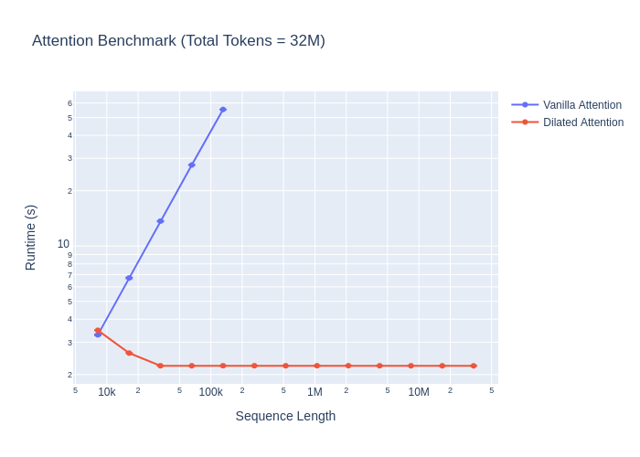

# dilated-attention-pytorch

(Unofficial) Implementation of `DilatedAttention` from *[LongNet: Scaling Transformers to 1,000,000,000 Tokens](https://arxiv.org/abs/2307.02486)* in PyTorch.


## Install

**NOTE**: This library depends on [facebookresearch/xformers](https://github.com/facebookresearch/xformers).  If you're not using `torch>=2.0.0`, you may need to install it from source.  See their [installation instructions](https://github.com/facebookresearch/xformers#installing-xformers).

PyPI:

```bash
pip install dilated-attention-pytorch
```

From source:
```bash
pip install "dilated-attention-pytorch @ git+ssh://git@github.com/fkodom/dilated-attention-pytorch.git"
```

For contributors:
```bash
# Install all dev dependencies (tests etc.)
pip install "dilated-attention-pytorch[all] @ git+ssh://git@github.com/fkodom/dilated-attention-pytorch.git"
# Setup pre-commit hooks
pre-commit install
```


## Benchmark

I follow the benchmarking procedure from the [LongNet paper](https://arxiv.org/abs/2307.02486) (Section 3.1) as best I can.  They tested in a distributed, multi-GPU setting (and by my estimation, with much better GPUs), and I test on a single GTX 2080 Ti, but the same general scaling trends still apply.  Rather than 1B tokens, I scale the batch size so that the total number of tokens is 32M, which is the largest sequence that fits in memory on my GPU when running dilated attention.

See: [benchmark.py](./benchmark.py)



> **NOTE**: Clearly, there are some inefficiencies in my `DilatedAttention` implementation for shorter sequence lengths.  I'm not sure what's causing this.  If you have any insights, please let me know!


## Usage

### `DilatedAttention`

The LongNet paper introduces a new attention mechanism called `DilatedAttention`.  It is a drop-in replacement (see below) for "vanilla" attention that allows for much longer sequences to be processed.

> **NOTE**: `DilatedAttention` only supports `batch_first=True`.  This is different from "vanilla" attention in PyTorch, which supports both `batch_first=True` and `batch_first=False`. 

#### Arguments:
- `segment_lengths` (required, `list[int]`): Length of each attention segment.  This is usually a geometric sequence increasing in powers of 2, such as `[2048, 4096, 8192]`.
- `dilation_rates` (required, `list[int]`): Dilation rate for each segment.  Like with `segment_lengths`, this is usually a geometric sequence increasing in powers of 2, such as `[1, 2, 4]`.


```python
import torch
from dilated_attention_pytorch.dilated_attention import DilatedAttention

dilated_attention = DilatedAttention(
    segment_lengths=[2048, 4096, 8192],
    dilation_rates=[1, 2, 4],
)

# shape: (batch_size, seq_len, num_heads, embed_dim)
# NOTE: 'seq_len' must be a multiple of 8192 (the largest segment length)
# NOTE: For best performance, use 'dtype=torch.float16' or `dtype=torch.bfloat16`
query = torch.randn(1, 8192, 8, 64, device="cuda", dtype=torch.float16)
key = torch.randn(1, 8192, 8, 64, device="cuda", dtype=torch.float16)
value = torch.randn(1, 8192, 8, 64, device="cuda", dtype=torch.float16)

out = dilated_attention(query, key, value, is_causal=False)  # default: causal=False
print(out.shape)
# torch.Size([1, 8192, 8, 64])
```


### `MultiheadDilatedAttention`

`MultiheadDilatedAttention` is a drop-in replacement (see below) for `nn.MultiheadAttention` that uses `DilatedAttention` instead of "vanilla" attention.  It also incorporates improvements from the [MAGNETO architecture](https://arxiv.org/abs/2210.06423) (`nn.LayerNorm` placements), as mentioned in the [LongNet paper](https://arxiv.org/abs/2307.02486).

> **NOTE**: `MultiheadDilatedAttention` only supports `batch_first=True`.  This is different from `nn.MultiheadAttention`, which supports both `batch_first=True` and `batch_first=False`.

#### Arguments:
- `segment_lengths` (required, `list[int]`): Length of each attention segment.  This is usually a geometric sequence increasing in powers of 2, such as `[2048, 4096, 8192]`.
- `dilation_rates` (required, `list[int]`): Dilation rate for each segment.  Like with `segment_lengths`, this is usually a geometric sequence increasing in powers of 2, such as `[1, 2, 4]`.
- Many of the same arguments from `nn.MultiheadAttention`.  See the `MultiheadDilatedAttention` class for more details.

```python
from dilated_attention_pytorch.dilated_attention import MultiheadDilatedAttention

device = torch.device("cuda")
dtype = torch.float16
embed_dim = 512

# NOTE: Omitting most of the optional arguments for brevity
mhda = MultiheadDilatedAttention(
    embed_dim=embed_dim,
    num_heads=8,
    segment_lengths=[2048, 4096, 8192],
    dilation_rates=[1, 2, 4],
    device=device,  # optional
    dtype=dtype,  # optional
)

# shape: (batch_size, seq_len, embed_dim)
# NOTE: 'seq_len' must be a multiple of 8192 (the largest segment length)
x = torch.randn(1, 8192, embed_dim, device=device, dtype=dtype)
y = mhda(x, x, x, is_causal=False)  # default: is_causal=False
print(y.shape)
# torch.Size([1, 8192, 512])
```


### `LongNet`

The [LongNet paper](https://arxiv.org/abs/2307.02486) culminates in a transformer architecture, which can be trained for language modeling with very long context windows.  I have implemented two `LongNet` variants, based on the **base** configurations from the paper:
- `LongNetLM` - designed specifically for language modeling
- `LongNet` - a more general encoder-decoder architecture, which is not specific to language modeling

Based on these implementations, it is fairly straightforward to adapt `LongNet` to encoder- or decoder-only architectures, as needed for specific applications.

```python
from dilated_attention_pytorch.long_net import LongNetLM, LongNet

device = torch.device("cuda")
dtype = torch.float16

# NOTE: Showing all default values, which are described in the paper.
net = LongNet(
    d_model=768,
    nhead=12,
    num_encoder_layers=12,
    num_decoder_layers=12,
    dim_feedforward=3072,
    segment_lengths=[2048, 4096, 8192, 16384, 32768],
    dilation_rates=[1, 2, 4, 6, 12],
    dropout=0.0,
    activation="relu",
    layer_norm_eps=1e-5,
    device=device,
    dtype=dtype,
)
# shape: (batch_size, seq_len, d_model)
x = torch.randn(1, 32768, 768, device=device, dtype=dtype)
with torch.no_grad():
    y = net.forward(x, is_causal=True)  # default: is_causal=True
print(y.shape)
# torch.Size([1, 32768, 768])

num_tokens = 10000  # (required) usually obtained from the tokenizer
lm = LongNetLM(
    num_tokens=num_tokens,
    d_model=768,
    nhead=12,
    num_encoder_layers=12,
    num_decoder_layers=12,
    dim_feedforward=3072,
    segment_lengths=[2048, 4096, 8192, 16384, 32768],
    dilation_rates=[1, 2, 4, 6, 12],
    dropout=0.0,
    activation="relu",
    layer_norm_eps=1e-5,
    device=device,
    dtype=dtype,
)
# shape: (batch_size, seq_len)
x = torch.randint(0, num_tokens, (1, 32768), device=device, dtype=torch.long)
with torch.no_grad():
    y = lm.forward(x, is_causal=True)  # default: is_causal=True
print(y.shape)
# torch.Size([1, 32768, num_tokens])
```

## Citations

```bibtex
@misc{ding2023longnet,
      title={LongNet: Scaling Transformers to 1,000,000,000 Tokens}, 
      author={Jiayu Ding and Shuming Ma and Li Dong and Xingxing Zhang and Shaohan Huang and Wenhui Wang and Nanning Zheng and Furu Wei},
      year={2023},
      eprint={2307.02486},
      archivePrefix={arXiv},
      primaryClass={cs.CL}
}
```
